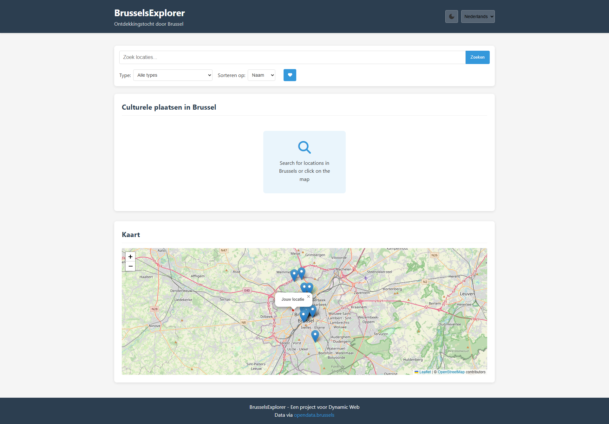

# DW-Project
Project for Dynamic Web

## Projectbeschrijving en functionaliteiten

#  BrusselsExplorer

BrusselsExplorer is een dynamische webapplicatie die gebruikers helpt culturele locaties in Brussel te ontdekken. De applicatie maakt gebruik van open data om locaties weer te geven op een interactieve kaart, inclusief filters en favorietenfunctionaliteit.

## 📌 Functionaliteiten  

- **Culturele locaties zoeken**: Ontdek welke Brusselse culturele locaties zich in jouw buurt bevinden.  
- **Interactieve kaart**: Bekijk jouw locatie en de culturele locaties in Brussel op een kaart.  
- **Zoeken op afstand**: Zoek locaties in de buurt of filter op afstand.  
- **Favorieten**: Bewaar jouw favoriete culturele locaties voor later.  
- **Meertalige ondersteuning**: Schakel tussen Nederlands, Frans en Engels.  
- **Donker thema**: Activeer een donkere modus voor een betere leeservaring.  

## 📂 Bestandenstructuur  

BrusselsExplorer/ │── index.html # Hoofdpagina met de UI-structuur
│── style.css # Stijlen voor de applicatie
│── index.mjs # Hoofd JavaScript-logica
│── README.md # Documentatie van het project

### Gebruikte API's met link

Cultural places located on the territory of the City of Brussels = 'https://opendata.brussels.be/api/explore/v2.1/catalog/datasets/bruxelles_lieux_culturels/records?limit=20'

#### Implementatie van elke technisch vereiste
*text staat voor welke bestand
*nummers staan voor de lijnen code
### 1. DOM Manipulatie
#### 1.1 Elementen Selecteren
index.mjs
5-19
#### 1.2 Elementen Manipuleren
index.mjs
292-312

#### 1.3 Events aan Elementen Koppelen
index.mjs
137-149
### 2. Modern JavaScript

#### 2.1 Constanten en Let
index.mjs
2
5-19
22-28
#### 2.2 Template Literals
index.mjs
315-346
#### 2.3 Iteratie over arrays
index.mjs
163-165
276-278
368-370
623-625
#### 2.4 Array Methodes
index.mjs
258-289
#### 2.5 Arrow Functions
index.mjs
515-521

139-141

#### 2.6 Conditional (ternary) operator (moderne if..else)
index.mjs
374-375
276-278

#### 2.7 Callback functions
index.mjs
55-57
623-625
368-370
#### 2.8 Promises
index.mjs
163-172
123-125
#### 2.9 Async/Await & Promises
index.mjs
195-255
    
211-248

489-508
#### Observer API

### 3. Data & API

#### 3.1 Fetch voor Data-ophaling
index.mjs
195-255
#### 3.2 JSON Manipulatie
index.mjs
386-413

412

480

524-527

635-648
### 4. Opslag & Validatie

#### 4.1 Formulier Validatie
index.mjs
421-428

23

264-271

548

258-271

#### 4.2 LocalStorage Gebruik
index.mjs
538-573
### 5. Styling & Layout

#### 5.1 Responsive Design met CSS
style.css
324-328

style.css
637-653

style.css
61-70

style.css
129-138

index.html
1-104

## Installatiehandleiding

Volg deze stappen om BrusselsExplorer te gebruiken:  

### 1️⃣ Open de applicatie  
- Open `index.html` in je browser.  

### 2️⃣ Accepteer de locatie-toegang  
- Bij het openen van de site vraagt de browser om toegang tot je locatie. Klik op **"Toestaan"** om de kaart en afstandsfuncties te laten werken.  

### 3️⃣ Gebruik de zoekfunctie  
- Typ de naam van een culturele locatie in de **zoekbalk** om snel de juiste plek te vinden.  

### 4️⃣ Thema wijzigen  
- Rechtsboven op de pagina kun je schakelen tussen **licht** en **donker thema**.  

### 5️⃣ Taal aanpassen  
- Naast de thema-knop kun je wisselen tussen **Nederlands, Frans en Engels**.  

### 6️⃣ Favorieten opslaan  
- Klik op het **favoriet-knopje** bij een locatie om deze op te slaan. Je favoriete locaties blijven bewaard, ook als je de pagina herlaadt.  

### 7️⃣ Locaties filteren op afstand  
- Sorteer locaties op basis van hoe **dichtbij of veraf** ze zijn.  

### 8️⃣ Bekijk de minimap  
- Onderaan de pagina zie je een **minimap** met jouw positie en de culturele locaties.  

### 9️⃣ Meer informatie over locaties  
- Helemaal onderaan de pagina vind je extra details over de culturele locaties.  

---

Veel plezier met BrusselsExplorer! 🎉  

## Screenshots van de website

## Gebruikte bronnen
darkmode:
https://www.youtube.com/watch?v=_gKEUYarehE

Ai logs
BlackBoxAi:
https://www.blackbox.ai/chat/o4J3Gqd
https://www.blackbox.ai/chat/Ui2gc5G

ChatGPT:
https://chatgpt.com/share/67eefe57-a888-8012-a1c0-6236274f7821
https://chatgpt.com/share/67eefee0-f4b4-8012-a83c-abf391ab48d5
## 👥 Ontwikkelaars
CSS > HTML > mjs
El Yazghi Yazid

mjs > HTML > CSS
Korchi Zakaria